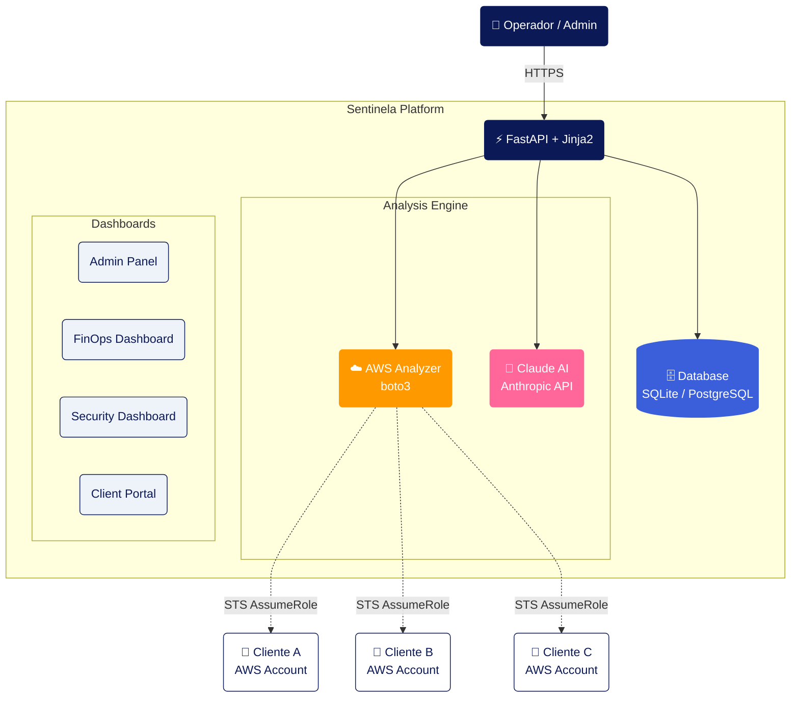

# Sentinela — AWS FinOps & Security Platform

  

> Plataforma multi-tenant que analisa contas AWS com IA, entregando visibilidade de custos, postura de segurança e plano de ação priorizado em ~10 minutos.

---

## Visão Geral

O **Sentinela** automatiza o que antes era feito manualmente: entrar em cada conta AWS de cliente, coletar dados de custo e segurança, cruzar informações e montar um relatório com recomendações priorizadas. Com integração ao **Claude AI (Anthropic)**, cada análise gera insights contextualizados com dados reais da conta — não respostas genéricas.

### O que a plataforma entrega

| Módulo | O que faz |
|--------|-----------|
| **FinOps Dashboard** | Custo mensal, tendência 12 meses, breakdown por serviço e UsageType, anomalias detectadas |
| **Modelo de Maturidade** | Score em 5 dimensões: tagging, rightsizing, commitments, waste elimination, governance |
| **Recursos Ociosos** | Volumes EBS desanexados, EIPs livres, instâncias paradas, Load Balancers sem tráfego |
| **Security Dashboard** | Score 0–100, findings críticos/altos/médios, IAM, S3, Security Groups, criptografia |
| **Análise Combinada** | Matriz de prioridades cruzando custo e risco — identifica o que é caro E inseguro ao mesmo tempo |
| **Quick Wins** | Ações de baixo esforço com economia estimada em $ e passo a passo |
| **Projetos** | Iniciativas estratégicas de médio prazo com ROI projetado |
| **Portal do Cliente** | Link read-only com token único para o cliente acompanhar o progresso |

---

## Arquitetura



### Fluxo de Análise

```
1. Admin cadastra cliente com ARN da Role IAM
         │
         ▼
2. Operador dispara análise via /admin/clients/{id}/analyze
         │
         ▼
3. aws_analyzer assume a role do cliente via STS
   e coleta ~30 fontes de dados em paralelo:
   Cost Explorer, EC2, RDS, EKS, Lambda, S3,
   IAM, GuardDuty, Security Hub, CloudTrail...
         │
         ▼
4. claude_analyzer envia os dados para Claude AI
   e recebe análise estruturada em JSON:
   • FinOps: score, savings, maturity, quick wins
   • Security: score, findings, quick wins
   • Combined: matriz de prioridades cruzada
         │
         ▼
5. Resultados salvos no banco e disponíveis
   nos dashboards admin + portal do cliente
```

---

## Stack Tecnológica

| Camada | Tecnologia |
|--------|-----------|
| Backend | Python 3.10+, FastAPI, SQLAlchemy |
| Frontend | Jinja2, HTML/CSS/JS vanilla, Chart.js |
| IA | Anthropic Claude API (claude-opus / claude-sonnet) |
| AWS SDK | boto3 |
| Banco de dados | SQLite (dev) / PostgreSQL (prod) |
| Containerização | Docker |
| Orquestração | Kubernetes (EKS) |
| Agendamento | APScheduler (análises automáticas periódicas) |

---

## Dados Coletados

### FinOps
| Dado | Serviço AWS |
|------|-------------|
| Custo por serviço e UsageType (12 meses) | Cost Explorer |
| Forecast próximo mês | Cost Explorer |
| Anomalias de custo detectadas | Cost Explorer |
| Recomendações de rightsizing | Compute Optimizer |
| Recomendações RI/Savings Plans | Cost Explorer |
| Volumes EBS desanexados | EC2 |
| Elastic IPs não usados | EC2 |
| Snapshots antigos (+90 dias) | EC2 |
| Instâncias paradas | EC2 |
| Load Balancers ociosos | ELBv2 |
| Buckets S3 (tamanho, lifecycle) | S3 + CloudWatch |
| Métricas de CPU/memória por instância | CloudWatch |
| Versões em suporte estendido (RDS, EKS, Lambda) | RDS/EKS/Lambda |

### Segurança
| Dado | Serviço AWS |
|------|-------------|
| Root MFA, política de senha | IAM |
| Usuários sem MFA | IAM |
| Chaves de acesso antigas (+90d) | IAM |
| Policies com permissão excessiva | IAM |
| Usuários inativos | IAM |
| Buckets S3 públicos | S3 |
| Buckets S3 sem criptografia | S3 |
| Security Groups abertos para 0.0.0.0/0 | EC2 |
| VPCs sem Flow Logs | EC2 |
| Volumes EBS não criptografados | EC2 |
| RDS não criptografados | RDS |
| GuardDuty por região | GuardDuty |
| CloudTrail status | CloudTrail |
| Security Hub findings | Security Hub |
| AWS Config regras com falha | Config |

---

## Instalação

Veja o [SETUP.md](SETUP.md) para instruções completas.

```bash
# Resumo rápido
git clone <repo>
cd sentinela
python3 -m venv venv && source venv/bin/activate
pip install -r requirements.txt
cp .env.example .env   # edite com suas chaves
uvicorn app.main:app --reload --port 8000
```

---

## Deploy em Produção (EKS)

```bash
# Configure as variáveis no deploy.sh e execute:
./deploy.sh
```

Os manifests Kubernetes estão em `k8s/`. Você precisará:
- Criar um repositório ECR
- Configurar o Secret `sentinela-env` com as variáveis do `.env.example`
- Ajustar o ARN da IAM Role e o domínio no `k8s/ingress.yaml`

---

## Variáveis de Ambiente

| Variável | Obrigatório | Descrição |
|----------|-------------|-----------|
| `ANTHROPIC_API_KEY` | ✅ | Chave da API Anthropic |
| `ANTHROPIC_MODEL` | ✅ | Modelo Claude (ex: `claude-sonnet-4-6`) |
| `ADMIN_SECRET_TOKEN` | ✅ | Senha do painel admin |
| `DATABASE_URL` | ✅ | SQLite ou PostgreSQL |
| `AWS_DEFAULT_REGION` | ✅ | Região AWS padrão |
| `FINOPS_AWS_PROFILE` | Dev | Perfil AWS local para desenvolvimento |
| `COGNITO_*` | Prod | Configurações OIDC para autenticação corporativa |

---

## Licença

MIT
