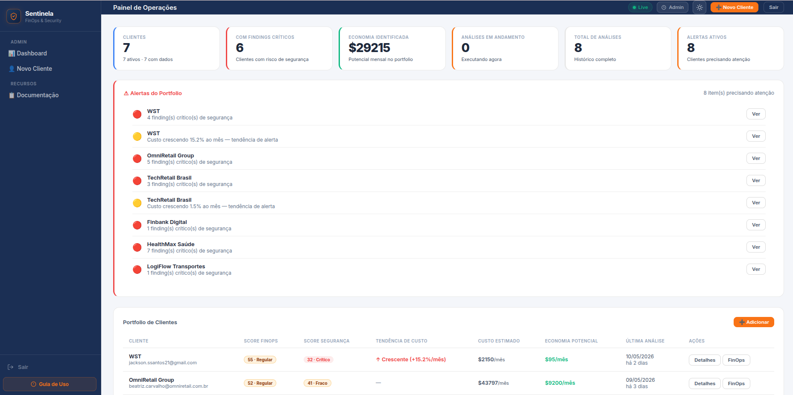
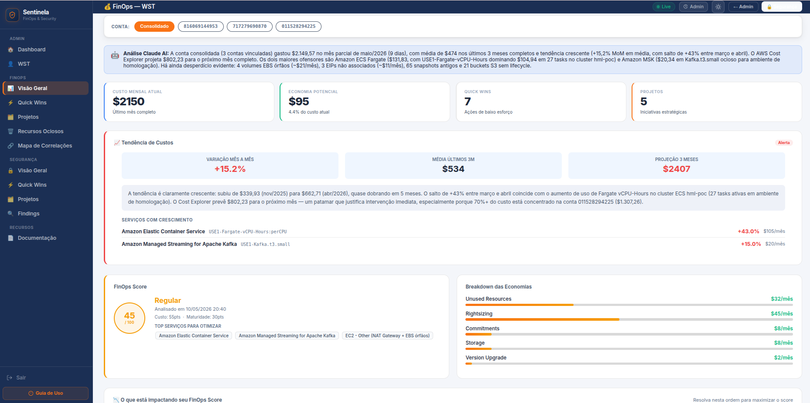
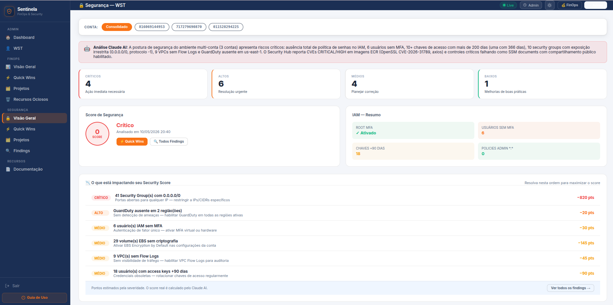
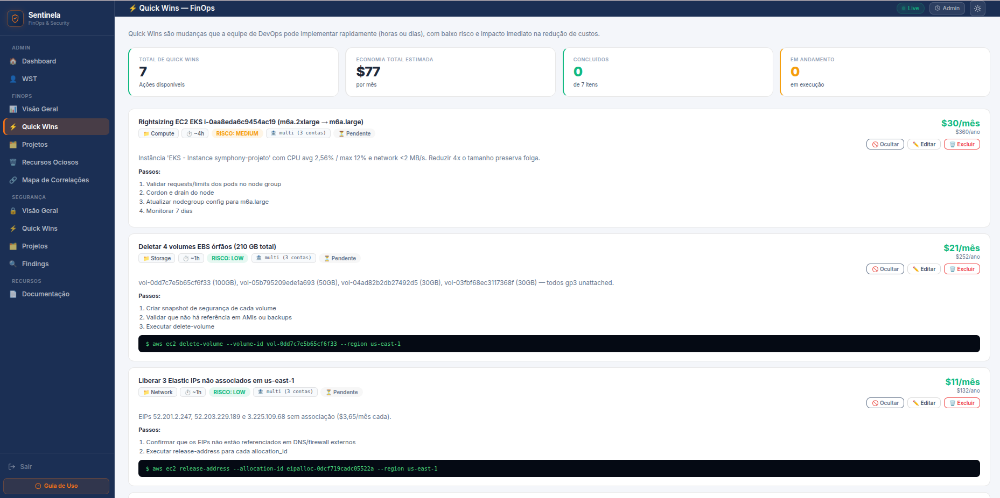
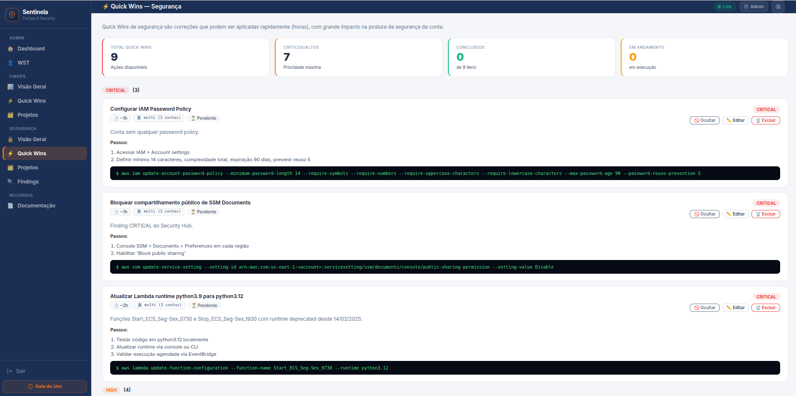
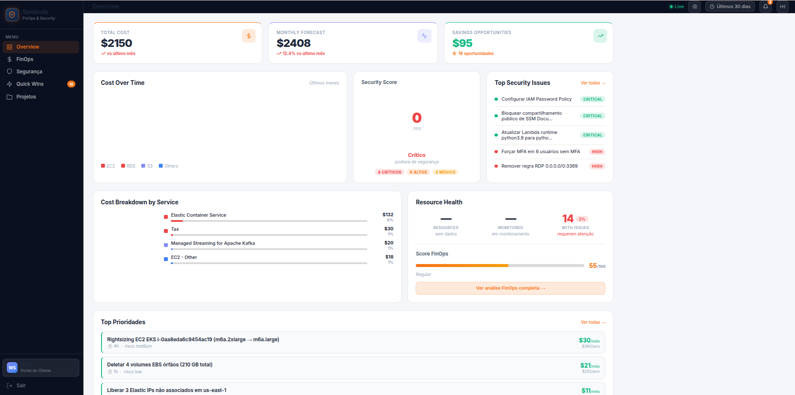
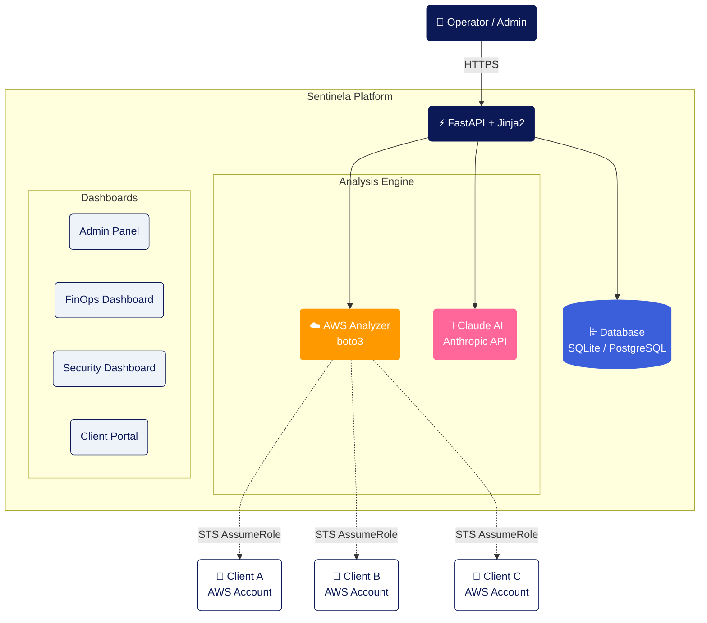

# Sentinela — AWS FinOps & Security Platform


> Multi-tenant platform that analyzes AWS accounts with AI, delivering cost visibility, security posture, and a prioritized action plan in ~10 minutes.



> **Note on language:** the UI and AI-generated reports are currently in Brazilian Portuguese (target audience: LATAM consultancies). Documentation is in English. Internationalization is on the roadmap.

---

## Why I built this

Working with FinOps and cloud security in consulting, I kept repeating the same manual cycle for every new client account:

1. Log into the AWS console, open Cost Explorer, export spreadsheets
2. Run a security checklist across IAM, S3, Security Groups, VPCs
3. Cross-reference everything in Excel to assemble a "what's expensive **and** insecure" slide
4. Write actionable quick wins with `aws cli` commands and savings estimates

Each report took 2–3 days, and the hardest part — **connecting cost to risk** — was almost always dropped because it didn't fit the deadline.

Sentinela was built to automate this flow end-to-end:

- **STS AssumeRole** removes credential juggling between accounts
- **Parallel collection** of ~30 AWS sources (Cost Explorer, EC2, RDS, IAM, GuardDuty, Security Hub…) in a single pass
- **Claude AI** turns raw data into contextualized analysis — not generic checklist answers
- **Combined matrix** surfaces resources that are both expensive **and** insecure
- **Read-only client portal** delivers the report to the customer without re-exporting PDFs

The result: what used to be 2–3 days of manual work became ~10 minutes of automated analysis.

---

## Screenshots

<details open>
<summary><b>Operations Panel (admin)</b></summary>

Consolidated client portfolio, prioritized alerts, FinOps and security scores side by side.


</details>

<details>
<summary><b>FinOps Dashboard</b></summary>

12-month cost trend, breakdown by service/UsageType, anomalies, and forecast.


</details>

<details>
<summary><b>Security Dashboard</b></summary>

Score 0–100, critical/high/medium findings, top issues ranked by score impact.


</details>

<details>
<summary><b>Quick Wins — FinOps</b></summary>

Low-effort actions with estimated USD savings, ready-to-run `aws cli` commands, and step-by-step instructions.


</details>

<details>
<summary><b>Quick Wins — Security</b></summary>

Security quick wins grouped by severity, with remediation commands and score-impact estimates.


</details>

<details>
<summary><b>Client Portal</b></summary>

Read-only view delivered to the client via a unique token — overview, FinOps, security, quick wins.


</details>

---

## Overview

**Sentinela** automates what used to be done by hand: connecting to each client's AWS account, collecting cost and security data, cross-referencing it, and producing a prioritized report. With **Claude AI (Anthropic)** integrated into every analysis, each insight is contextualized with the account's real data — not generic recommendations.

### What the platform delivers

| Module | What it does |
|--------|--------------|
| **FinOps Dashboard** | Monthly cost, 12-month trend, breakdown by service and UsageType, detected anomalies |
| **Maturity Model** | Score across 5 dimensions: tagging, rightsizing, commitments, waste elimination, governance |
| **Idle Resources** | Detached EBS volumes, unused EIPs, stopped instances, Load Balancers with no traffic |
| **Security Dashboard** | 0–100 score, critical/high/medium findings, IAM, S3, Security Groups, encryption |
| **Combined Analysis** | Priority matrix crossing cost and risk — identifies what is expensive AND insecure at the same time |
| **Quick Wins** | Low-effort actions with estimated USD savings and step-by-step instructions |
| **Projects** | Medium-term strategic initiatives with projected ROI |
| **Client Portal** | Read-only link with a unique token for the client to follow progress |

---

## Architecture



### Analysis flow

```
1. Admin registers a client with an IAM Role ARN
         │
         ▼
2. Operator triggers analysis via /admin/clients/{id}/analyze
         │
         ▼
3. aws_analyzer assumes the client's role via STS
   and collects ~30 data sources in parallel:
   Cost Explorer, EC2, RDS, EKS, Lambda, S3,
   IAM, GuardDuty, Security Hub, CloudTrail…
         │
         ▼
4. claude_analyzer sends the data to Claude AI
   and receives structured JSON analysis:
   • FinOps: score, savings, maturity, quick wins
   • Security: score, findings, quick wins
   • Combined: cross-priority matrix
         │
         ▼
5. Results stored in the database and surfaced
   in the admin dashboards + client portal
```

Detailed technical decisions (why SQLite + PostgreSQL, why STS AssumeRole, why Jinja2 instead of a SPA, etc.) live in **[docs/ARCHITECTURE.md](docs/ARCHITECTURE.md)**.

---

## Tech stack

| Layer | Technology |
|-------|-----------|
| Backend | Python 3.10+, FastAPI, SQLAlchemy |
| Frontend | Jinja2, vanilla HTML/CSS/JS, Chart.js |
| AI | Anthropic Claude API (claude-opus / claude-sonnet) |
| AWS SDK | boto3 |
| Database | SQLite (dev) / PostgreSQL (prod) |
| Containerization | Docker |
| Orchestration | Kubernetes (EKS) |
| Scheduling | APScheduler (automatic periodic analyses) |

---

## Data collected

### FinOps
| Data | AWS service |
|------|-------------|
| Cost by service and UsageType (12 months) | Cost Explorer |
| Next-month forecast | Cost Explorer |
| Detected cost anomalies | Cost Explorer |
| Rightsizing recommendations | Compute Optimizer |
| RI / Savings Plans recommendations | Cost Explorer |
| Detached EBS volumes | EC2 |
| Unused Elastic IPs | EC2 |
| Old snapshots (+90 days) | EC2 |
| Stopped instances | EC2 |
| Idle Load Balancers | ELBv2 |
| S3 buckets (size, lifecycle) | S3 + CloudWatch |
| CPU/memory metrics per instance | CloudWatch |
| Extended-support versions (RDS, EKS, Lambda) | RDS / EKS / Lambda |

### Security
| Data | AWS service |
|------|-------------|
| Root MFA, password policy | IAM |
| Users without MFA | IAM |
| Old access keys (+90 days) | IAM |
| Overly permissive policies | IAM |
| Inactive users | IAM |
| Public S3 buckets | S3 |
| Unencrypted S3 buckets | S3 |
| Security Groups open to 0.0.0.0/0 | EC2 |
| VPCs without Flow Logs | EC2 |
| Unencrypted EBS volumes | EC2 |
| Unencrypted RDS instances | RDS |
| GuardDuty per region | GuardDuty |
| CloudTrail status | CloudTrail |
| Security Hub findings | Security Hub |
| AWS Config failing rules | Config |

---

## Quickstart

### Prerequisites
- Python 3.10+
- AWS credentials configured locally (CLI or environment variables)
- An [Anthropic API key](https://console.anthropic.com)

### Running locally

```bash
# 1. Clone and prepare the environment
git clone https://github.com/jacksonmlk/sentinela-opensource.git
cd sentinela-opensource
python3 -m venv venv && source venv/bin/activate
pip install -r requirements.txt

# 2. Configure environment variables
cp .env.example .env
# edit .env and fill in at least:
#   ANTHROPIC_API_KEY=sk-ant-...
#   ADMIN_SECRET_TOKEN=something-secure
#   AWS_DEFAULT_REGION=us-east-1

# 3. Start the app
uvicorn app.main:app --reload --port 8000

# 4. Open
open http://localhost:8000
# you'll be redirected to /admin/login — use the ADMIN_SECRET_TOKEN from .env
```

### Onboarding your first client

In the client's AWS account, create a role with trust to your operator account and attach the `ReadOnlyAccess` + `SecurityAudit` policies. The full walkthrough (trust policy, `aws cli` commands, credential modes) is in **[SETUP.md](SETUP.md)**.

### Production deploy (EKS)

```bash
# Configure variables in deploy.sh and run:
./deploy.sh
```

Kubernetes manifests live in `k8s/`. You'll need to:
- Create an ECR repository
- Configure the `sentinela-env` Secret with the variables from `.env.example`
- Adjust the IAM Role ARN and domain in `k8s/ingress.yaml`

---

## Environment variables

| Variable | Required | Description |
|----------|----------|-------------|
| `ANTHROPIC_API_KEY` | ✅ | Anthropic API key |
| `ANTHROPIC_MODEL` | ✅ | Claude model (e.g. `claude-sonnet-4-6`) |
| `ADMIN_SECRET_TOKEN` | ✅ | Admin panel password |
| `DATABASE_URL` | ✅ | SQLite or PostgreSQL |
| `AWS_DEFAULT_REGION` | ✅ | Default AWS region |
| `FINOPS_AWS_PROFILE` | Dev | Local AWS profile for development |
| `COGNITO_*` | Prod | OIDC settings for corporate authentication |

---

## Status and known limitations

Sentinela is in **beta** — it works end-to-end and is used in production, but some rough edges remain:

- **No automated tests yet.** The focus so far was validating the flow with real clients. Adding smoke tests + CI is at the top of the list.
- **Schema migrations via manual `ALTER TABLE`** in the FastAPI `lifespan` ([app/main.py](app/main.py)) — works for the current schema, but Alembic is the natural next step.
- **AWS only.** GCP and Azure are out of scope for now.
- **Multi-tenant by row, not by database.** Fits a consultancy workflow; not hardened for a public SaaS model.
- **Anthropic API cost per analysis.** A full analysis costs anywhere from a few cents to a few dollars depending on account size and model (Sonnet vs Opus).
- **Portuguese UI.** Templates, prompts, and reports are in PT-BR. Internationalization is not yet implemented.

## Future ideas

Not a formal roadmap — directions that make sense. No timelines.

- [ ] Multi-cloud support (GCP first, then Azure)
- [ ] Smoke tests + CI on GitHub Actions
- [ ] Migrate schema management to Alembic
- [ ] Background-job PDF/Docx export (currently synchronous)
- [ ] Webhook on analysis completion (Slack/Teams/Discord)
- [ ] Historical diff between consecutive analyses of the same client
- [ ] Drift detection — alert when score drops between runs
- [ ] English UI / i18n

Contributions are welcome — see **[CONTRIBUTING.md](CONTRIBUTING.md)**.

---

## Security

Found a vulnerability? Please **do not open a public issue**. See **[SECURITY.md](SECURITY.md)** for the responsible-disclosure channel.

---

## License

[MIT](LICENSE) © Jackson Santos
